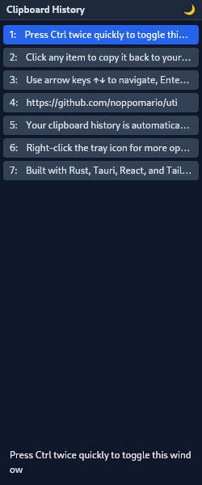

<div align="center">

# uti


[](https://github.com/noppomario/uti/releases)
[](https://github.com/noppomario/uti/actions/workflows/ci.yml)
[](LICENSE)
[](https://github.com/noppomario/uti)

[](https://www.rust-lang.org/)
[](https://tauri.app/)
[](https://react.dev/)
[](https://www.typescriptlang.org/)
[](https://tailwindcss.com/)
[](https://bun.sh/)
[](https://biomejs.dev/)
[](https://vitejs.dev/)

> 🚀 A modern clipboard manager for Linux with double-Ctrl toggle

Built with Rust backend and modern web frontend

</div>

## 🎯 Why uti?

**Solving the challenges of Wayland environments with modern tooling.**

- 🔒 **Wayland Limitations**: Unlike X11, Wayland restricts global keyboard
  shortcuts. Launching apps with double Ctrl press cannot be achieved through
  standard desktop settings.

- 🔍 **No Existing Tools**: No clipboard manager was found that works natively
  on Wayland and can be triggered by double Ctrl press.

- ⚡ **Daemon Architecture**: A dedicated Rust daemon monitors keyboard input
  via evdev, enabling flexible shortcuts independent of the desktop environment.

- 🦀 **Modern Stack**: Built entirely with Rust backend, React 19 frontend,
  and tooling like Bun, Biome, and Vite for maximum developer experience.

## 📸 Screenshot



## ✨ Features

- 🎹 **Double Ctrl Toggle**: Press Ctrl twice quickly (within 300ms) to show/hide the window
- 📋 **Clipboard History**: Stores clipboard items for quick access
- 🖥️ **System Tray**: Runs in the background with tray icon control
- 🚀 **Auto-start**: Optional auto-start on login
- 🔄 **Self-update**: Update via `uti update` command or tray menu

## 📦 What Gets Installed

When you install uti, the following changes are made to your system:

| Component | Location | Description |
| --------- | -------- | ----------- |
| **uti** | `/usr/bin/uti` | Main application (RPM package) |
| **double-ctrl** | `/usr/bin/double-ctrl` | Keyboard daemon (RPM package) |
| **User service** | `~/.config/systemd/user/` | Daemon autostart service |
| **Config** | `~/.config/uti/` | User configuration and clipboard history |
| **Input group** | `/etc/group` | Your user is added to the `input` group |

### ⚠️ About the Input Group

The daemon needs to read keyboard events from `/dev/input/*` devices. This
requires membership in the **input group**. The installer automatically adds
your user to this group.

**Security note**: Members of the input group can read all input devices
(keyboard, mouse). This is necessary for the double-Ctrl detection to work.

## 🚀 Quick Start

Install with one command:

```bash
curl -fsSL https://raw.githubusercontent.com/noppomario/uti/main/install.sh | bash
```

After installation, **log out and log back in** (required for input group), then
run `uti`.

## 📖 Usage

### Basic Operation

1. Press **Ctrl twice quickly** to toggle window visibility
2. Click on clipboard items to copy them back
3. Use arrow keys to navigate, Enter to select

### System Tray

Right-click the tray icon for options:

- **Show/Hide**: Toggle window visibility
- **Auto-start**: Enable/disable start on login
- **Check for Updates...**: Check for new versions
- **GitHub**: Open project page
- **Quit**: Exit application

### Updating

Check for and install updates:

```bash
uti update
```

Check only (without installing):

```bash
uti update --check
```

## ⚙️ Configuration

Configuration file: `~/.config/uti/config.json`

```json
{
  "theme": "dark",
  "clipboardHistoryLimit": 50,
  "showTooltip": true,
  "tooltipDelay": 500
}
```

| Option                  | Type    | Default | Description                  |
| ----------------------- | ------- | ------- | ---------------------------- |
| `theme`                 | string  | `dark`  | UI theme: `dark` or `light`  |
| `clipboardHistoryLimit` | number  | `50`    | Max clipboard items to store |
| `showTooltip`           | boolean | `true`  | Show tooltip on hover        |
| `tooltipDelay`          | number  | `500`   | Tooltip delay in ms          |

## 🛠️ Tech Stack

| Layer | Technology |
| ----- | ---------- |
| 🦀 Backend | Rust + Tauri 2 |
| ⚛️ Frontend | React 19 + TypeScript 5.7 |
| 🎨 Styling | Tailwind CSS v4 |
| 📦 Bundler | Vite 6 + Bun |
| 🔧 Linting | Biome (25-100x faster than ESLint) |
| 🎹 Daemon | Rust + evdev + D-Bus |

## 📋 System Requirements

- **OS**: Linux (Fedora 43+ recommended)
- **Desktop**: GNOME (Wayland/X11), KDE, XFCE
- **Architecture**: x86_64

### GNOME Users

GNOME 43+ requires the AppIndicator extension for system tray:

1. Install Extension Manager (if not installed):
   - Open GNOME Software
   - Search "Extension Manager" and install

2. Install AppIndicator extension:
   - Open Extension Manager
   - Search "AppIndicator and KStatusNotifierItem Support"
   - Click Install

3. Log out and back in

<details>
<summary><strong>🔧 Troubleshooting</strong></summary>

### Daemon Won't Start

Check if you're in the input group:

```bash
groups  # Should include "input"
```

If not, add yourself and log out/in:

```bash
sudo usermod -aG input $USER
```

Check daemon status:

```bash
systemctl --user status double-ctrl.service
journalctl --user -u double-ctrl.service -n 50
```

### Tray Icon Not Visible (GNOME)

Install AppIndicator extension via Extension Manager (see GNOME Users section
above).

</details>

## 🗑️ Uninstallation

```bash
sudo dnf remove uti double-ctrl
```

This automatically stops and disables the daemon service.

To remove yourself from the input group (optional):

```bash
sudo gpasswd -d $USER input
```

## 👨‍💻 Development

For development setup, see [DEVELOPMENT.md](docs/DEVELOPMENT.md).

## ⚠️ Known Limitations

- **Window appears in dock (Wayland)**: On Wayland, the window appears in the
  dock when visible. This is a Tauri limitation
  ([#9829](https://github.com/tauri-apps/tauri/issues/9829)).
- **Window position**: Window always appears at screen center (Wayland does
  not support cursor-relative positioning).

## 📄 License

[MIT](LICENSE)
