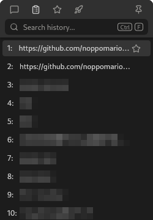
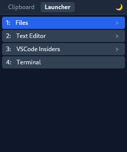
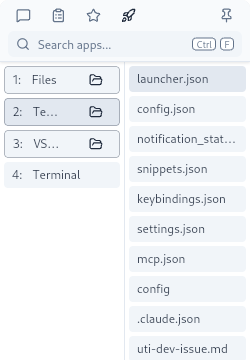

<div align="center">


# uti

[](https://github.com/noppomario/uti/releases)
[](https://github.com/noppomario/uti/actions/workflows/ci.yml)
[](LICENSE)
[](https://github.com/noppomario/uti)

[](https://www.rust-lang.org/)
[](https://tauri.app/)
[](https://react.dev/)
[](https://www.typescriptlang.org/)
[](https://tailwindcss.com/)
[](https://bun.sh/)
[](https://biomejs.dev/)
[](https://vitejs.dev/)

> A modern clipboard manager and app launcher for Linux with double-Ctrl toggle





</div>

## ✨ Features

- 🎹 **Double Ctrl Toggle**: Press Ctrl twice quickly (within 300ms) to show/hide the window
- 📋 **Clipboard History**: Stores clipboard items for quick access
- ⭐ **Snippets**: Pin frequently used text for quick access (star icon in clipboard history)
- 🚀 **App Launcher**: Quick-launch configured applications with jump lists (recent files)
- 💬 **Prompt**: Quick text input with auto-paste to active window (Ctrl+Enter)
- 🔍 **Search**: Filter clipboard history or search system applications in real-time
- 📌 **Window Pinning**: Pin button keeps the window always-on-top with auto-hide disabled
- 🖥️ **System Tray**: Runs in the background with tray icon control
- 📍 **Cursor Positioning**: Window appears at cursor location on GNOME
- 🔄 **Auto-start & Self-update**: Optional auto-start on login, update via CLI or tray menu


## 📋 System Requirements

- **OS**: Linux with systemd (Fedora 43+ recommended)
- **Desktop**: GNOME 45+ on Wayland (recommended), other Wayland/X11 environments (limited)
- **Architecture**: x86_64

## 🚀 Quick Start

Install with one command:

```bash
curl -fsSL https://raw.githubusercontent.com/noppomario/uti/main/install.sh | bash
```

After installation, **log out and log back in** (required for input group), then run `uti`.

<details>
<summary><strong>GNOME Users</strong></summary>

On GNOME, the installer automatically installs the "uti for GNOME" extension. After logging back in, enable it:

```bash
gnome-extensions enable uti@noppomario.github.io
```

> **Note**: GNOME Shell only detects newly installed local extensions after a logout/login. The extension cannot be enabled until you log back in.

This extension provides:

- **Panel icon with full menu** (same menu as system tray)
- **Cursor-relative window positioning** (window appears at cursor location)

The extension displays Tauri's tray icon directly, so no additional extensions (like AppIndicator) are required.

Without the extension, uti still works but the window appears at screen center.

</details>

<details>
<summary>Using AppIndicator instead?</summary>

If you already have AppIndicator extension installed and prefer to use it, disable the extension's tray icon:

```bash
gsettings set org.gnome.shell.extensions.uti enable-tray-icon false
```

</details>

## 🎯 Why uti?

**Solving the challenges of Wayland environments with modern tooling.**

- 🔒 **Wayland Limitations**: Wayland restricts global keyboard shortcuts. Launching apps with double Ctrl press cannot be achieved through standard desktop settings. Additionally, Wayland prevents apps from querying global cursor position or setting their own window position, requiring compositor (GNOME Shell) integration for cursor-relative window positioning.

- 🔍 **No Existing Tools**: No clipboard manager was found that works natively on Wayland and can be triggered by double Ctrl press.

- ⚡ **Daemon Architecture**: A dedicated Rust daemon monitors keyboard input via evdev, enabling flexible shortcuts independent of the desktop environment.

- 🦀 **Modern Stack**: Built entirely with Rust backend, React 19 frontend, and tooling like Bun, Biome, and Vite for maximum developer experience.

- 🧩 **GNOME Integration**: Custom extension displays window at cursor position and provides native panel icon—features impossible for regular Wayland apps.

## 🛠️ Tech Stack

| Layer | Technology |
| ----- | ---------- |
| 🦀 Backend | Rust + Tauri 2 |
| ⚛️ Frontend | React 19 + TypeScript 5.7 |
| 🎨 Styling | Tailwind CSS v4 |
| 📦 Bundler | Vite 6 + Bun |
| 🔧 Linting | Biome (25-100x faster than ESLint) |
| 🎹 Daemon | Rust + evdev + uinput + D-Bus |

## 📖 Usage

### Basic Operation

1. Press **Ctrl twice quickly** to toggle window visibility
2. Use **←/→** to switch between Clipboard, Snippets, Launcher, and Prompt tabs
3. Use **↑/↓** to navigate items, **Enter** to select
4. Press **1-9** to quickly select an item by its number
5. Press **Ctrl+F** to focus the search bar
6. **Type to search**: Filter items or search system applications
7. **Escape** clears search and returns focus to the list
8. In **Clipboard tab**, press **S** or click **⭐** (star icon) to pin item to Snippets
   - Item is immediately added to Snippets tab
   - Item is removed from Clipboard when the window closes
9. In **Launcher tab**, press **→** to expand jump list (recent files)
10. In **Prompt tab**: Type text and press **Ctrl+Enter** to paste to active window
    - Text is copied to clipboard, window hides, and text is pasted to the previously active window
    - **Note**: Auto-paste uses Ctrl+Shift+V, optimized for terminal emulators. Regular text editors may require manual paste (Ctrl+V).
11. Click **📌** (pin button) to keep window always-on-top and disable auto-hide
    - **Note**: Always-on-top requires the "uti for GNOME" extension on GNOME/Wayland. Without the extension, only auto-hide is disabled.

### System Tray

Right-click the tray icon for options:

- **Show/Hide**: Toggle window visibility
- **Auto-start**: Enable/disable start on login
- **Check for Updates...**: Check for new versions
- **GitHub**: Open project page
- **Quit**: Exit application

### Updating

Check for and install updates:

```bash
uti update
```

Check only (without installing):

```bash
uti update --check
```

## ⚙️ Configuration

Configuration file: `~/.config/uti/config.json`

```json
{
  "theme": {
    "color": "dark",
    "size": "normal"
  },
  "clipboardHistoryLimit": 50
}
```

| Option                  | Type   | Default                            | Description                  |
| ----------------------- | ------ | ---------------------------------- | ---------------------------- |
| `theme.color`           | string | `dark`                             | `midnight`, `dark`, `light`  |
| `theme.size`            | string | `normal`                           | `minimal`, `normal`, `wide`  |
| `clipboardHistoryLimit` | number | `50`                               | Max clipboard items to store |

### Snippets Data

Snippets are stored in `~/.config/uti/snippets.json`:

```json
{
  "items": [
    { "id": "my-email", "label": "My Email", "value": "user@example.com" }
  ]
}
```

- `id`: Unique identifier (any string; auto-generated UUID when added via UI)
- `label`: Optional display name (shows `value` if omitted)
- `value`: The actual text to copy

To add snippets manually, edit this file with any unique `id` string.

### Launcher Configuration

Launcher commands: `~/.config/uti/launcher.json`

```json
{
  "commands": [
    {
      "id": "nautilus",
      "name": "Files",
      "command": "nautilus",
      "historySource": { "type": "recently-used", "appName": "org.gnome.Nautilus" }
    },
    {
      "id": "vscode",
      "name": "VSCode",
      "command": "code",
      "historySource": { "type": "vscode", "path": "~/.config/Code/User/globalStorage/state.vscdb" }
    }
  ]
}
```

For detailed configuration options, see [Launcher Configuration Guide](docs/launcher-config.md).

## 🔧 Troubleshooting

<details>
<summary><strong>Daemon Won't Start</strong></summary>

Check if you're in the input group:

```bash
groups  # Should include "input"
```

If not, add yourself and log out/in:

```bash
sudo usermod -aG input $USER
```

Check daemon status:

```bash
systemctl --user status uti-daemon.service
journalctl --user -u uti-daemon.service -n 50
```

</details>

<details>
<summary><strong>Tray Icon Not Visible (GNOME)</strong></summary>

Enable uti for GNOME (see GNOME Users section above).

</details>

## 🗑️ Uninstallation

```bash
sudo dnf remove uti uti-daemon
```

This automatically stops and disables the daemon service.

To remove the GNOME extension (optional):

```bash
rm -rf ~/.local/share/gnome-shell/extensions/uti@noppomario.github.io
```

To remove yourself from the input group (optional):

```bash
sudo gpasswd -d $USER input
```

## ⚠️ Known Limitations

- **Window appears in dock (Wayland)**: On Wayland, the window appears in the dock when visible. This is a Tauri limitation ([#9829](https://github.com/tauri-apps/tauri/issues/9829)).
- **Window position (non-GNOME)**: On non-GNOME Wayland environments (KDE, Sway, etc.), window always appears at screen center. Enable uti for GNOME for cursor positioning.
- **Jump list app support**: Only apps that write to `recently-used.xbel` (GTK/GNOME apps) and VSCode are supported. KDE apps and most Electron apps are not supported.

## 🏗️ Architecture

| Component | Role |
| --------- | ---- |
| **uti-daemon** | Detects double Ctrl press via evdev |
| **uti** | Clipboard manager + App launcher UI (Tauri) |
| **uti for GNOME** | GNOME Shell extension for tray icon, cursor positioning, and always-on-top control (optional) |

For details, see [Architecture Documentation](docs/ARCHITECTURE.md).

## 📦 What Gets Installed

When you install uti, the following changes are made to your system:

| Component | Location | Description |
| --------- | -------- | ----------- |
| **uti** | `/usr/bin/uti` | Main application (RPM package) |
| **uti-daemon** | `/usr/bin/uti-daemon` | Keyboard daemon (RPM package) |
| **User service** | `~/.config/systemd/user/` | Daemon autostart service |
| **Config** | `~/.config/uti/` | User configuration, clipboard history, snippets, launcher config |
| **Input group** | `/etc/group` | Your user is added to the `input` group |
| **udev rule** | `/etc/udev/rules.d/99-uti-uinput.rules` | Enables uinput access for auto-paste |
| **uti for GNOME** | `~/.local/share/gnome-shell/extensions/` | GNOME Shell extension (GNOME only) |

### ⚠️ About the Input Group

The daemon needs to read keyboard events from `/dev/input/*` devices and write to `/dev/uinput` for auto-paste. This requires membership in the **input group**. The installer automatically adds your user to this group.

**Security note**: Members of the input group can read all input devices (keyboard, mouse) and create virtual input devices. This is necessary for double-Ctrl detection and auto-paste to work.

## 👨‍💻 Development

For development setup, see [DEVELOPMENT.md](docs/DEVELOPMENT.md).

## 📄 License

[MIT](LICENSE)
