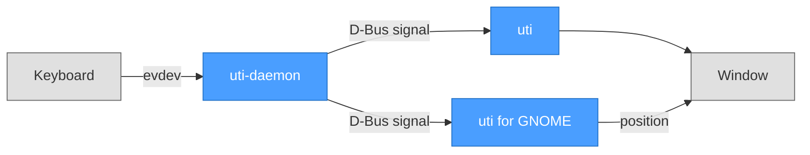
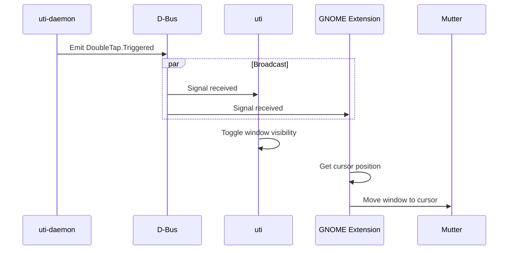
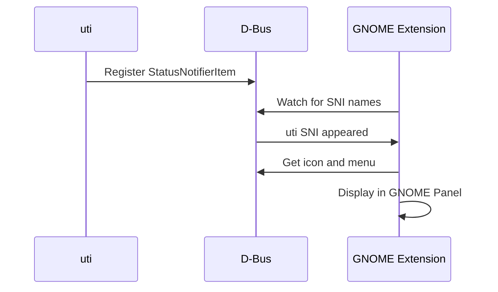

# Architecture

This document describes the architecture of uti across different platforms and configurations.

## Overview

uti is a clipboard manager that is invoked by pressing Ctrl twice quickly. Due to platform security restrictions (especially on Wayland), a multi-component architecture is required on Linux.



## Requirements

- **Linux** with D-Bus session bus and glibc
- **systemd** for daemon service management
- User in `input` group for keyboard access

**Optional**: "uti for GNOME" extension enables tray icon and cursor positioning on **GNOME/Wayland**. Without it, window appears at screen center.

---

## Components

### uti-daemon

Rust daemon that monitors keyboard input and detects double Ctrl press.

| Property | Value |
| -------- | ----- |
| Language | Rust |
| Input | evdev (`/dev/input/event*`) |
| Output | D-Bus signal |
| Permissions | `input` group membership |
| Service | `uti-daemon.service` (systemd user) |

**D-Bus Interface:**

- Name: `io.github.noppomario.uti`
- Interface: `io.github.noppomario.uti.DoubleTap`
- Path: `/io/github/noppomario/uti/DoubleTap`
- Signal: `Triggered()` - emitted on double Ctrl press

### uti (Tauri App)

Main application with clipboard history UI.

| Property | Value |
| -------- | ----- |
| Frontend | React 19 + TypeScript |
| Backend | Rust + Tauri 2 |
| IPC | D-Bus (receive), StatusNotifierItem (tray) |
| Config | `~/.config/uti/config.json` |
| Data | `~/.config/uti/clipboard.json` |

### uti for GNOME

GNOME Shell extension that provides:

1. **Tray icon display** - Acts as StatusNotifierHost to show Tauri's tray
2. **Cursor positioning** - Moves window to cursor location on toggle

| Property | Value |
| -------- | ----- |
| UUID | `uti@noppomario.github.io` |
| Settings | GSettings (`org.gnome.shell.extensions.uti`) |
| Protocol | StatusNotifierItem/DBusMenu |

---

## Linux: GNOME + Wayland (Primary)

The recommended configuration for GNOME desktop.

### Toggle Window Sequence



### Tray Icon Sequence



---

## D-Bus Interfaces

### DoubleTap Interface (Daemon → App)

```xml
<interface name="io.github.noppomario.uti.DoubleTap">
  <signal name="Triggered"/>
</interface>
```

### StatusNotifierItem (App → Extension)

The Tauri app registers as a StatusNotifierItem on the session bus:

- Bus name: `org.kde.StatusNotifierItem-{pid}-1`
- Object path: `/StatusNotifierItem`
- Interfaces: `org.kde.StatusNotifierItem`, `org.freedesktop.DBusMenu`

The extension acts as a StatusNotifierHost, watching for this name and proxying the icon and menu to the GNOME panel.

---

## File Locations

| File | Purpose |
| ---- | ------- |
| `/usr/bin/uti` | Main application |
| `/usr/bin/uti-daemon` | Keyboard daemon |
| `~/.config/systemd/user/uti-daemon.service` | Daemon service |
| `~/.config/uti/config.json` | User configuration |
| `~/.config/uti/clipboard.json` | Clipboard history |
| `~/.local/share/gnome-shell/extensions/uti@noppomario.github.io/` | GNOME extension |
