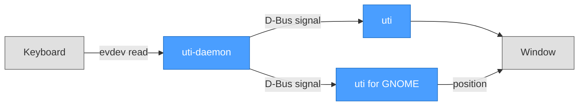
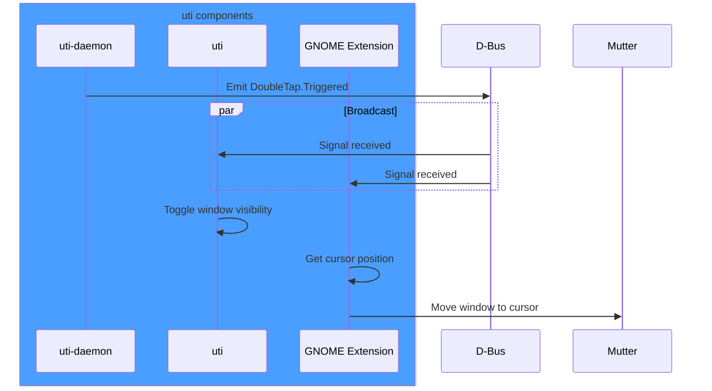
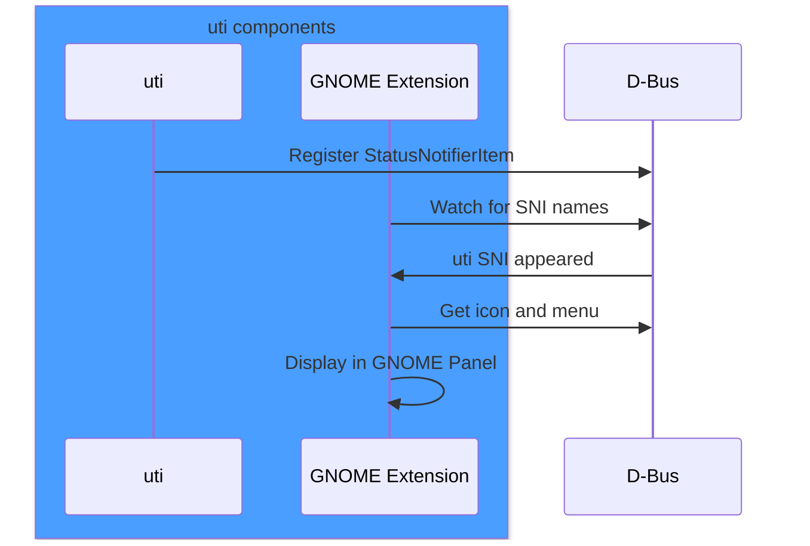
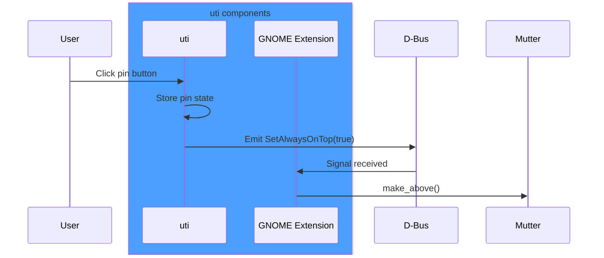
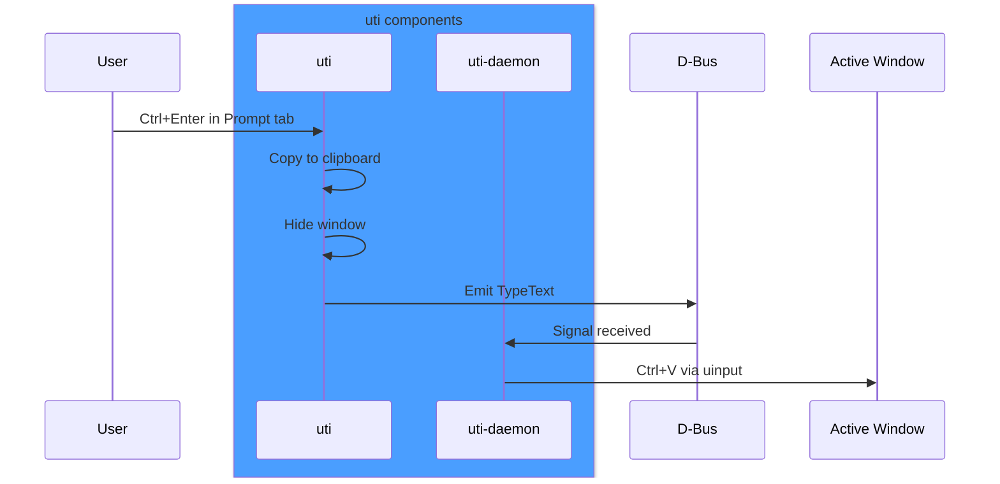

# Architecture

This document describes the architecture of uti across different platforms and configurations.

## Overview

uti is a clipboard manager and app launcher that is invoked by pressing Ctrl twice quickly. Due to platform security restrictions (especially on Wayland), a multi-component architecture is required on Linux.



## Requirements

- **Linux** with D-Bus session bus and glibc
- **systemd** for daemon service management
- User in `input` group for keyboard access

**Optional**: "uti for GNOME" extension enables tray icon, cursor positioning, and always-on-top control on **GNOME/Wayland**. Without it, window appears at screen center and pin button only disables auto-hide.

---

## Components

### uti-daemon

Rust daemon that monitors keyboard input, detects double Ctrl press, and provides
virtual keyboard for auto-paste functionality.

| Property | Value |
| -------- | ----- |
| Language | Rust |
| Input | evdev (`/dev/input/event*`), D-Bus signals |
| Output | D-Bus signal, uinput (`/dev/uinput`) |
| Permissions | `input` group membership |
| Service | `uti-daemon.service` (systemd user) |

**D-Bus Interface:**

- Name: `io.github.noppomario.uti`
- Interface: `io.github.noppomario.uti.DoubleTap`
- Path: `/io/github/noppomario/uti/DoubleTap`
- Signals:
  - `Triggered()` - emitted on double Ctrl press
  - `SetAlwaysOnTop(enabled: bool)` - emitted by uti app when pin state changes

### uti (Tauri App)

Main application with clipboard history and app launcher UI.

| Property | Value |
| -------- | ----- |
| Frontend | React 19 + TypeScript |
| Backend | Rust + Tauri 2 |
| IPC | D-Bus (receive), StatusNotifierItem (tray) |
| Config | `~/.config/uti/config.json` |
| Launcher | `~/.config/uti/launcher.json` |
| Clipboard | `~/.config/uti/clipboard.json` |
| Snippets | `~/.config/uti/snippets.json` |

**Snippets Feature:**

- Pin clipboard items via star icon for quick access
- Items immediately appear in Snippets tab
- Pinned items removed from Clipboard on window close
- Manual editing via JSON file supported

**Launcher Features:**

- Configurable application commands with keyboard navigation
- Jump lists showing recent files from system history (recently-used.xbel)
- VSCode recent files support via SQLite database

### uti for GNOME

GNOME Shell extension that provides:

1. **Tray icon display** - Acts as StatusNotifierHost to show Tauri's tray
2. **Cursor positioning** - Moves window to cursor location on toggle
3. **Always-on-top control** - Handles `SetAlwaysOnTop` signal to set window layer via `Meta.Window.make_above()` (Mutter ignores app-level always-on-top requests on Wayland)

| Property | Value |
| -------- | ----- |
| UUID | `uti@noppomario.github.io` |
| Settings | GSettings (`org.gnome.shell.extensions.uti`) |
| Protocol | StatusNotifierItem/DBusMenu |

---

## Linux: GNOME + Wayland (Primary)

The recommended configuration for GNOME desktop.

### Toggle Window Sequence



### Tray Icon Sequence



### Pin State Toggle Sequence



### Prompt Auto-Paste Sequence



---

## D-Bus Interfaces

### DoubleTap Interface

Shared interface for daemon-to-app and app-to-extension communication:

```xml
<interface name="io.github.noppomario.uti.DoubleTap">
  <signal name="Triggered"/>
  <signal name="SetAlwaysOnTop">
    <arg name="enabled" type="b"/>
  </signal>
  <signal name="TypeText"/>
</interface>
```

| Signal | Sender | Receiver | Purpose |
| ------ | ------ | -------- | ------- |
| `Triggered` | uti-daemon | uti, GNOME Extension | Double Ctrl press detected |
| `SetAlwaysOnTop` | uti | GNOME Extension | Pin state changed |
| `TypeText` | uti | uti-daemon | Trigger auto-paste via Ctrl+V |

### StatusNotifierItem (App → Extension)

The Tauri app registers as a StatusNotifierItem on the session bus:

- Bus name: `org.kde.StatusNotifierItem-{pid}-1`
- Object path: `/StatusNotifierItem`
- Interfaces: `org.kde.StatusNotifierItem`, `org.freedesktop.DBusMenu`

The extension acts as a StatusNotifierHost, watching for this name and proxying the icon and menu to the GNOME panel.

---

## File Locations

| File | Purpose |
| ---- | ------- |
| `/usr/bin/uti` | Main application |
| `/usr/bin/uti-daemon` | Keyboard daemon |
| `/etc/udev/rules.d/99-uti-uinput.rules` | uinput access for auto-paste |
| `~/.config/systemd/user/uti-daemon.service` | Daemon service |
| `~/.config/uti/config.json` | User configuration |
| `~/.config/uti/launcher.json` | Launcher commands |
| `~/.config/uti/clipboard.json` | Clipboard history |
| `~/.config/uti/snippets.json` | Pinned snippets |
| `~/.local/share/gnome-shell/extensions/uti@noppomario.github.io/` | GNOME extension |
