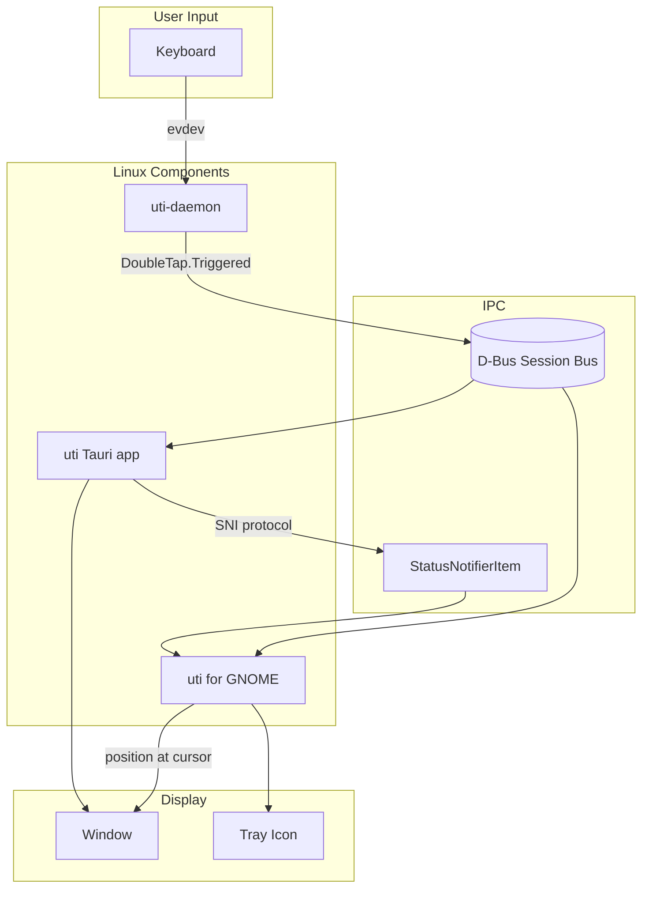
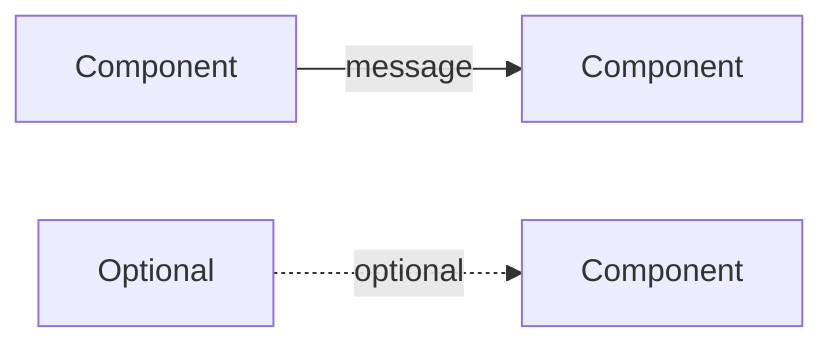
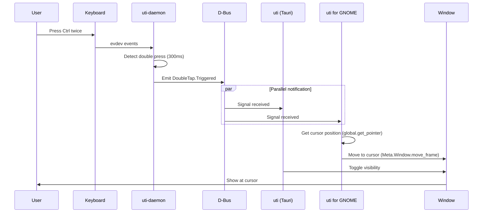
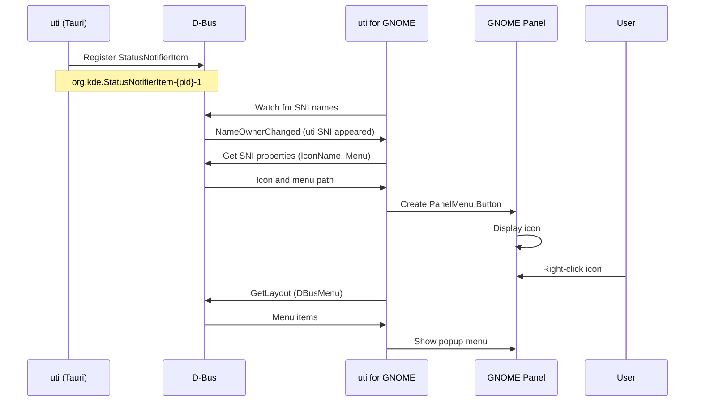
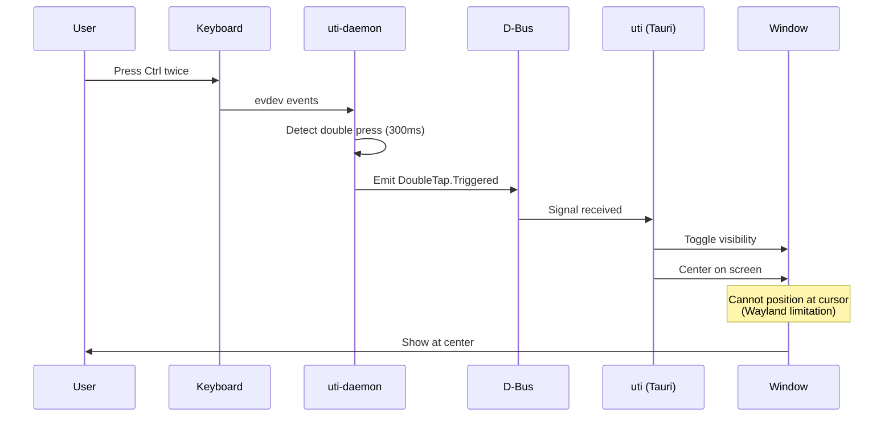
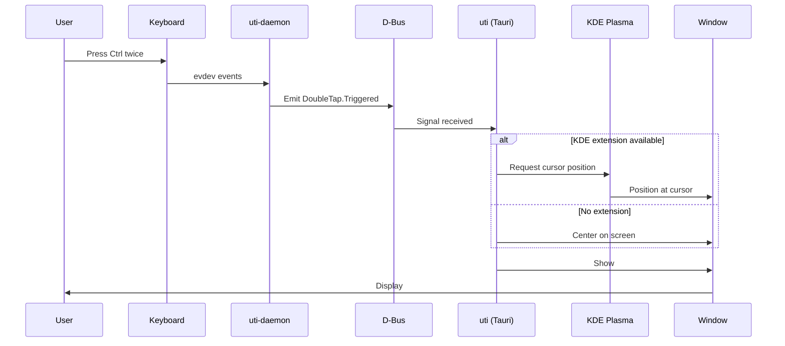
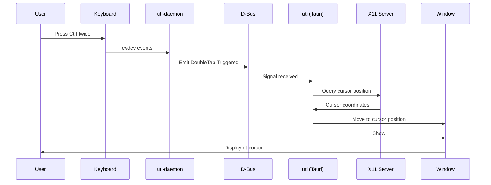
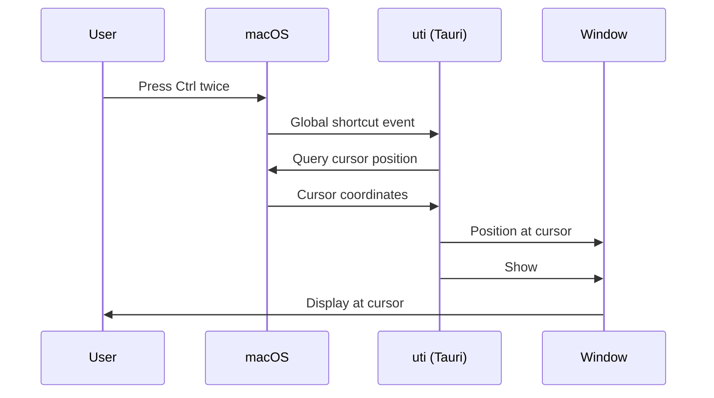
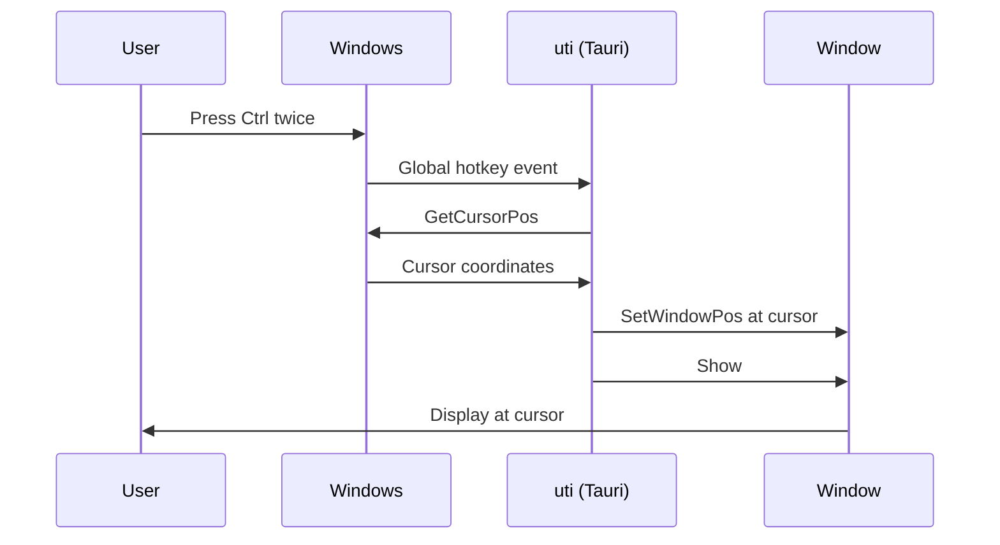

# Architecture

This document describes the architecture of uti across different platforms and
configurations.

## Overview

uti is a clipboard manager that is invoked by pressing Ctrl twice quickly. Due
to platform security restrictions (especially on Wayland), a multi-component
architecture is required on Linux.



## Components

### uti-daemon

Rust daemon that monitors keyboard input and detects double Ctrl press.

| Property | Value |
| -------- | ----- |
| Language | Rust |
| Input | evdev (`/dev/input/event*`) |
| Output | D-Bus signal |
| Permissions | `input` group membership |
| Service | `uti-daemon.service` (systemd user) |

**D-Bus Interface:**

- Name: `io.github.noppomario.uti`
- Interface: `io.github.noppomario.uti.DoubleTap`
- Path: `/io/github/noppomario/uti/DoubleTap`
- Signal: `Triggered()` - emitted on double Ctrl press

### uti (Tauri App)

Main application with clipboard history UI.

| Property | Value |
| -------- | ----- |
| Frontend | React 19 + TypeScript |
| Backend | Rust + Tauri 2 |
| IPC | D-Bus (receive), StatusNotifierItem (tray) |
| Config | `~/.config/uti/config.json` |
| Data | `~/.config/uti/clipboard.json` |

### uti for GNOME

GNOME Shell extension that provides:

1. **Tray icon display** - Acts as StatusNotifierHost to show Tauri's tray
2. **Cursor positioning** - Moves window to cursor location on toggle

| Property | Value |
| -------- | ----- |
| UUID | `uti@noppomario.github.io` |
| Settings | GSettings (`org.gnome.shell.extensions.uti`) |
| Protocol | StatusNotifierItem/DBusMenu |

---

## Platform Configurations

### Legend



---

## Linux: GNOME + Wayland (Primary)

The recommended configuration for GNOME desktop.

### Components Required

| Component | Required | Purpose |
| --------- | -------- | ------- |
| uti-daemon | Yes | Double Ctrl detection |
| uti | Yes | Clipboard manager |
| uti for GNOME | Yes | Tray + cursor positioning |

### Sequence: Toggle Window



### Sequence: Tray Icon Display



---

## Linux: GNOME + Wayland (AppIndicator Alternative)

For users who prefer AppIndicator extension over uti for GNOME.

### Components Required

| Component | Required | Purpose |
| --------- | -------- | ------- |
| uti-daemon | Yes | Double Ctrl detection |
| uti | Yes | Clipboard manager |
| AppIndicator extension | Yes | Tray icon |
| uti for GNOME | No | Not needed |

### Sequence: Toggle Window



### Limitations

- Window appears at screen center (not at cursor)
- Requires third-party AppIndicator extension

---

## Linux: KDE Plasma + Wayland (Future)

KDE has native StatusNotifierItem support.

### Components Required

| Component | Required | Purpose |
| --------- | -------- | ------- |
| uti-daemon | Yes | Double Ctrl detection |
| uti | Yes | Clipboard manager |
| KDE extension | Maybe | Cursor positioning (TBD) |

### Sequence: Toggle Window



### Notes

- Tray icon works natively (KDE supports SNI)
- Cursor positioning may require KWin script or Plasma extension
- Investigation needed for window positioning API

---

## Linux: X11 (Any Desktop)

X11 has fewer restrictions than Wayland.

### Components Required

| Component | Required | Purpose |
| --------- | -------- | ------- |
| uti-daemon | Yes | Double Ctrl detection |
| uti | Yes | Clipboard manager |
| Extension | No | X11 allows direct positioning |

### Sequence: Toggle Window



### Notes

- No extension needed for cursor positioning
- Tray works with standard system tray (X11 tray protocol)
- libxdo can be used for window positioning

---

## macOS (Future)

macOS allows global shortcuts and has native tray support.

### Components Required

| Component | Required | Purpose |
| --------- | -------- | ------- |
| uti-daemon | No | macOS allows global shortcuts |
| uti | Yes | Clipboard manager |

### Sequence: Toggle Window



### Notes

- Single binary distribution
- Native menu bar integration
- Accessibility permissions may be required for global shortcuts

---

## Windows (Future)

Windows allows global shortcuts and has native tray support.

### Components Required

| Component | Required | Purpose |
| --------- | -------- | ------- |
| uti-daemon | No | Windows allows global shortcuts |
| uti | Yes | Clipboard manager |

### Sequence: Toggle Window



### Notes

- Single executable distribution
- Native system tray support
- No special permissions required for hotkeys

---

## Configuration Matrix

| Platform | Daemon | Extension | Tray | Cursor Position |
| -------- | ------ | --------- | ---- | --------------- |
| GNOME/Wayland | Required | uti for GNOME | Extension | Extension |
| GNOME/Wayland | Required | AppIndicator | AppIndicator | Center only |
| KDE/Wayland | Required | TBD | Native | TBD |
| Any/X11 | Required | None | Native | Native |
| macOS | None | None | Native | Native |
| Windows | None | None | Native | Native |

---

## D-Bus Interfaces

### DoubleTap Interface (Daemon → App)

```xml
<interface name="io.github.noppomario.uti.DoubleTap">
  <signal name="Triggered"/>
</interface>
```

### StatusNotifierItem (App → Extension)

The Tauri app registers as a StatusNotifierItem on the session bus:

- Bus name: `org.kde.StatusNotifierItem-{pid}-1`
- Object path: `/StatusNotifierItem`
- Interfaces:
  - `org.kde.StatusNotifierItem` - Icon properties
  - `org.freedesktop.DBusMenu` - Menu items

The extension acts as a StatusNotifierHost, watching for this name and
proxying the icon and menu to the GNOME panel.

---

## File Locations

| File | Purpose |
| ---- | ------- |
| `/usr/bin/uti` | Main application |
| `/usr/bin/uti-daemon` | Keyboard daemon |
| `~/.config/systemd/user/uti-daemon.service` | Daemon service |
| `~/.config/uti/config.json` | User configuration |
| `~/.config/uti/clipboard.json` | Clipboard history |
| `~/.local/share/gnome-shell/extensions/uti@noppomario.github.io/` | GNOME extension |
